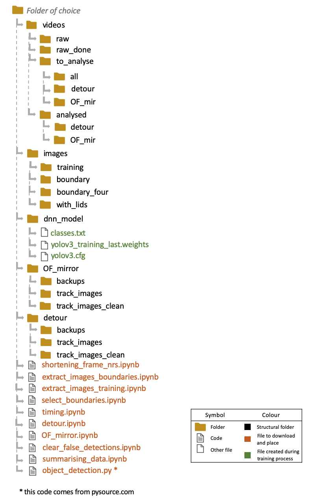
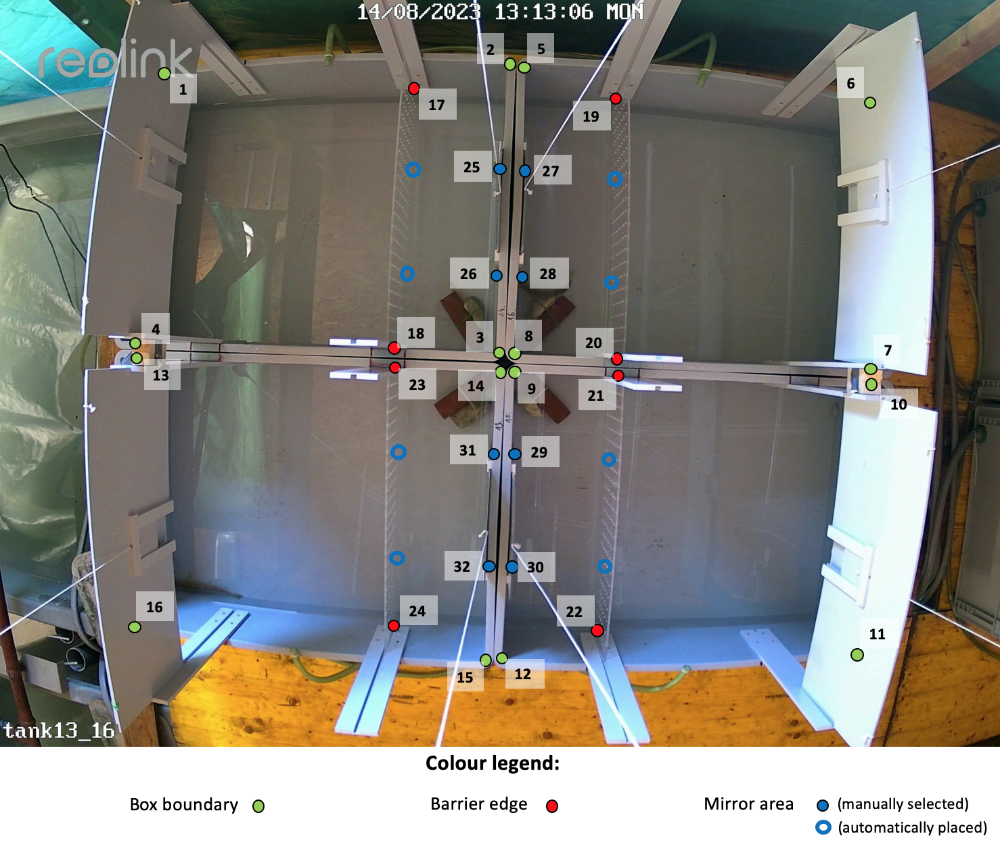

### Description of the setup:
This set of codes was designed for a project where trout were filmed as behavioural tests. There were up to four trout in each video, all kept in separate boxes. The trout were tested through an open field test, barrier navigation, and reaction to colourful objects (in the form of red and blue lids). The videos were analysed using Python (Jupyter Notebook via Anaconda). These codes are based on the a similar project called <a href="https://github.com/P-Hansson/eel-tracking/">eel-tracking</a>.
The following packages are required:
* opencv
* shapely
 

### Description of the file structure to be:
The following diagram shows the file structure. Note that the codes do not create this folder structure if it does not exist, so the necessary folders must be present before running the codes.  

 
 

### Training the model:
The training uses YOLOv3 and was done following the instructions and accompanying code of <a href="https://pysource.com/2020/04/02/train-yolo-to-detect-a-custom-object-online-with-free-gpu/">pysource.com</a>
 
 

### Description of the different codes:
**shortening_frame_nrs**
This code is used to decrease the number of frames in the video, going through every video in the “videos/raw” folder. In the example code, every tenth frame is saved **. The shortened videos are saved in the folder “videos/to_analyse/all” and the original videos are moved to “videos/raw_done”

**extract_images_boundaries**
This code extracts an image of each video in the folder “videos/to_analyse/all” and saves them to “images/boundary”, for later use in the selection of the boundaries of the containers housing the fish. In the example code, frame number 3500 is extracted, to ensure that the image is extracted once the starting box had been fully opened.

**extract_images_training**
This code extracts images from each video in the folder “videos/to_analyse/all” and saves them to “images/training”, for later use to train the detection algorithm. In the example code, every hundredth frame starts being extracted after frame 1000.

**select_boundaries**
This file contains two codes, one to extract the box boundaries and the placement of the mirrors and barriers, and another to extract the placement of the red and blue lids. Since each camera and box had permanent positions, only four boundary videos were necessary to extract the correct boundaries **. All videos had a name with a section that matched the camera used, and was therefore used to match the corresponding boundary coordinates. The first code shows one image from the folder “images/boundary_four” at a time, allowing you to select the boundaries of the containers, saving it in the file “Boundary_coords.csv”. The setup is for four square containers per image, with one barrier and one mirror in each, resulting in 40 points in total (although the user only selects 32 of those). Space bar is used to jump to the next image, and if enough points were selected, the coordinates are saved. The order of the selection is described on the image while selecting the points, and is also shown in the image below.  
  
The second code shows one image from the folder “images/with_lids” at a time, allowing you to select the position of the red and blue lids, saving it in the file “OF_mirror/Lid_coords.csv”. The order of selection is described in the image while selecting the points, and for missing or obstructed lids, there is the alternative to skip selecting the positioning of that lid by marking it as missing. Selection is done at the center point of the lid.

**timing**
This code allows you to select the timing of the opening of the starting box door, as well as the full opening of the starting box and release of the mirror. It shows every video in the folder “videos/to_analyse/OF_mir” and saves the frame number of the corresponding event in the file “OF_mirror/Timing_OF_mir.csv”. The d key is used to save the frame when the doors are opened - if it is already open at the start of the video, the o key should be pressed instead. Space bar is used when the starting boxes have been fully lifted - if it is already lifted at the start of the video, the b key should be pressed instead. The m key is used to save the frame when the mirror is dropped in and the escape button allows to skip forward in the list of videos. The timings will only be saved if all the timings (door, starting box, mirror) have been selected. 

**detour**
This code detects and tracks the fish in the videos in the folder “videos/to_analyse/detour”, saving the coordinates in the file “detour/Detour_data.csv” and any multiple detections in one box in the file “detour/Dupes_in_boxes.csv”. It uses the boundary of the boxes and barrier from the “Boundary_coords.csv” file. The resulting csv data file contains information on the coordinates of the position of each fish, whether it is past the barrier, and the certainty of the detection. The resulting csv dupe file contains the video name, box number, and frame number of the multiple detections, which can be used to clear out incorrect detections. The code also creates an image of the track of the fish superimposed on the final frame of the video in the folder “detour/track_images”, as well as saving a clean version of the final frame without the track in the folder “detour/track_images_clean”.

**OF_mirror**
This code detects and tracks the fish in the videos in the folder “videos/to_analyse/OF_mir”, saving the coordinates in the file “OF_mirror/OF_mirror_data.csv” and any multiple detections in one box in the file “OF_mirror/Dupes_in_boxes.csv”. It uses the boundary of the boxes and mirror from the “Boundary_coords.csv” file, as well as the coordinates of the lids from the “OF_mirror/Lid_coords.csv” file. The resulting csv data file contains information on the coordinates of the position of each fish, whether it is in the mirror section or close to any lid, as well as the certainty of the detection. It also contains information on if the fish was next to any lid (boundary polygons overlapping or center point of fish inside the lid boundary), the width of the video, and the number of frames in the full video. The resulting csv dupe file contains the video name, box number, and frame number of the multiple detections, which can be used to clear our incorrect detections. The code also creates an image of the track of the fish superimposed on the final frame of the video in the folder “OF_mirror/track_images”, as well as saving a clean version of the final frame without the track in the folder “OF_mirror/track_images_clean”

**clear_false_detections**
This file contains six codes, three for the cleaning of the detour data, and three for the cleaning of the open field mirror data. The only difference between the two versions of the three codes, is what files they use. Below is a description of the three codes. NOTE: even though the duplicate detections are specifically marked in a different colour than the normal detections, it does not mean that a video without duplicate detections is without incorrect detections. Make sure to look at the track for any unrealistic detections, even if there are no duplicate such.  
*Marking*: This code goes through every image in the respective “track_images_clean” folder, mapping the detection points from the data files to allow for the marking of whether or not the data from that video requires some coordinate removal or not. If there were any duplicate detections, these are marked with an orange colour, the first detection is marked with a green colour, while all other detections are marked with yellow points. Pressing the “y” button marks the respective video as done, while the “n” button marks it as still requiring clean up. The marked data file, whether the videos are marked as done or not, is saved as “detour/Detour_data_new.csv” or “OF_mirror/OF_mirror_data_new.csv” respectively, and contains a column for whether the video is done or not.  
*Selecting*: This code uses every image in the respective “track_images_clean” folder to map out the detection points from the data files of the videos marked as not being done. Regular coordinates are yellow in colour, ones with duplicates are orange in colour, and the first detection is green in colour. By pressing a coordinate point, this coordinate is marked for removal, and those are saved in the “detour/To_remove.csv” and “OF_mirror/To_remove.csv” file respectively.  
*Clearing*: This code clears out the marked coordinates from the data file. First, it creates a backup of the data file in the respective “backups” folder, then removes the coordinates marked in the respective “To_remove.csv” file, saving the new cleared out data using the same name as the input data file (which now has been backed up in case something goes wrong). It then creates a new track image for any video that has had detections removed, and finally goes through the new data to see if all duplicate detections in the boxes has been cleared. If not, a new file is created with the video name, box number, and frame of the detections that still have multiple detections in one box. 

**summarising_data**
This file contains two codes, one for summarising the data for the detour test, and one for summarising the data for the open field mirror test. Below is a description of the two codes.
*Detour*: This code goes through the “detour/Detour_data_new.csv” file and counts the number of time each fish passed the barrier, summarising it in the file “detour/Sum_detour.csv” with a column of video name, box number, and the number of passes.  
*Open field and mirror*: This code goest through the “OF_mirror/OF_mirror_data_new.csv” file to summarise the different tests. It uses the “OF_mirror/Timing_OF_mir.csv” to separate the different test times. The resulting file “OF_mirror/Sum_OF_mir.csv” contains basic information of the video name, the number of frames in the video, the size of the video, the frames per second, the box number, and the number of frames in which the fish was detected. It also contains the summarised information on the different test aspects. The following list explains the columns in the final summarised data:
* Door_open: the frame when the door was opened, from the timing file
* First_frame: the first frame where the fish was detected
* Full_emergence: TRUE or FALSE on if the emergence test was carried out for the planned full 15 minutes
* Emerged: TRUE or FALSE on if the fish emerged through the door before the end of the 15 minute emergence test time, as well as the category “Before” if the fish had already escaped the starting box before the emergence test started
* Distance: the total distance the fish swam, in centimetres, during the 20 minute open field test
* Shorter: if the open field test was shorter than the planned 20 minutes, this column states how many frames the open field test was and how many it should have consisted of
* Detected_frames_OF: total number of frames where the fish was detected during the open field test, compared to total number of frames in the open field test
* Longest_no_detect_OF: max amount of frames during the open field test in which there were no detections in the box
* Frames_mirror: the number of frames that the fish spent in the mirror area while the mirror test was ongoing
* Time_mirror: time spent in the mirror area while the mirror test was ongoing
* Detected_frames_mir: total number of frames where the fish was detected during the mirror test, compared to total number of frames in the mirror test
* Lid columns: the several columns of lid data represent the different colours of lids, the different test times (emergence and open field), and two ways of counting spending time next to the lids: the fish detection center point inside the lid’s boundary box vs the fish detection box intersecting the lid’s boundary box. All these columns show either the number of frames the fish was detected next to the lid, or the time spent by the lid. 
 

** NOTE: some videos had a different frame rate, size, were rotated, or had barriers placed differently. For these, alternative codes that took those aspects into account were used, but in all other regards, the analysis was done in the same way.
